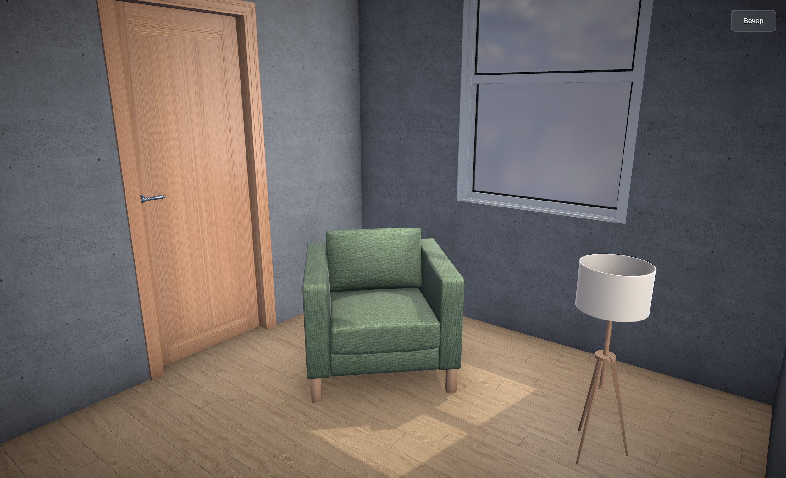
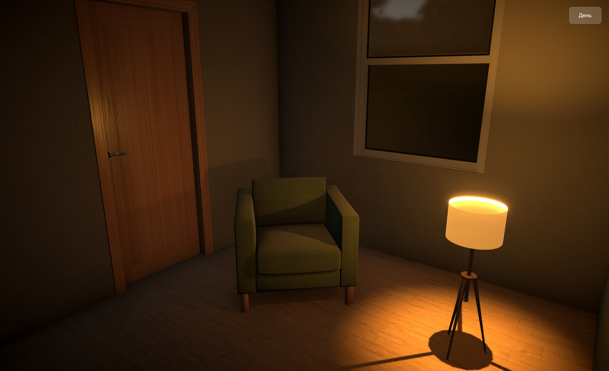

# PBR Demo 3D

Фотореалистичная интерьерная сцена с PBR материалами и динамическим освещением.

<p align="center">
  
</p>

<p align="center">
  
</p>

## Почему Three.js

Я выбрал Three.js, потому что это индустриальный стандарт. У меня большой опыт работы с этой библиотекой, что позволяет мне писать чистый, поддерживаемый код и гибко настраивать рендер без ограничений "готовых движков".

Для вашей задачи (процедурная генерация квартиры) Three.js идеален: он дает низкоуровневый контроль над геометрией, необходимый для построения стен и проемов "на лету" из JSON-данных.

Выбрал Three.js потому что это индустриальный стандарт. Плюс у меня большой опыт работы с этой библиотекой, что позволяет мне писать чистый, поддерживаемый код и гибко настраивать рендер без ограничений "готовых движков".

Для текущей задачи (процедурная генерация квартиры) Three.js идеален: он дает низкоуровневый контроль над геометрией, необходимый для построения стен и проемов "на лету" из JSON-данных. (также много готовых модулей к нему)

## Как устроен свет

### День

Имитация естественного освещения.
* **HDRI** - карта облачного дня для реалистичных отражений.
* **DirectionalLight** - основной солнечный свет (жесткие тени, блики).
* **AmbientLight** - мягкое высветление глубоких теней.
* **HemisphereLight** - имитация глобального освещения (разный оттенок света от неба и от земли).
* **Post-processing** - Bloom (блики на полу) и SSAO (затенение в углах).

### Вечер

ААкцент на искусственные источники и уют (Cozy Atmosphere).
* **HDRI** - ночная карта (минимум света снаружи).
* **SpotLights** - композитный свет торшера (основной конус вниз + мягкий засвет потолка + боковой свет).
* **Emissive Material** - абажур реально излучает свет и взаимодействует с Bloom.
* **SSAO** - подчеркивает геометрию в темноте.

## Материалы

Использован честный PBR Workflow.
Стекло: MeshPhysicalMaterial (transmission, roughness) для реалистичных отражений ночью.
Поверхности: MeshStandardMaterial с картами нормалей и шероховатости.

## Что улучшить

Если развивать проект в полноценный продукт:
CSG (Constructive Solid Geometry): Для сложных оконных проемов лучше использовать булевы операции, а не ручное разбиение мешей.
Baking / Light Probes / AO: Запекание света дало бы еще больше реализма и увеличит фпс.
JSON Parser: Реализовать парсер, который строит такую комнату автоматически по входящим координатам (как в описании вашей вакансии).

## Запуск

```bash
npm install
npm run dev
```

Проект откроется на `http://localhost:3000`

## Управление

- **ЛКМ + движение мыши** - вращение камеры
- **SHIFT + ЛКМ + движение мыши** - панорамирование (panning)
- **Колесо мыши** - приближение/отдаление
- **Кнопка "День"/"Вечер"** - переключение режима освещения

## Технологии

- Three.js v0.160.0
- Vite

---

**License:** MIT  
**Copyright:** 2025 Nurgeldi Dovletov
